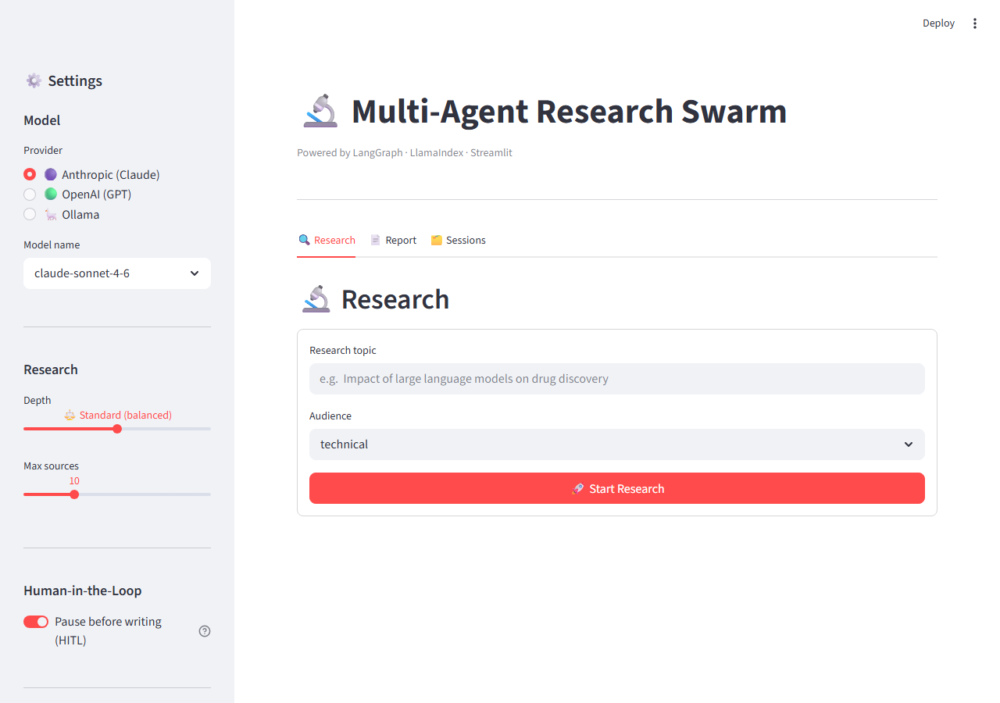
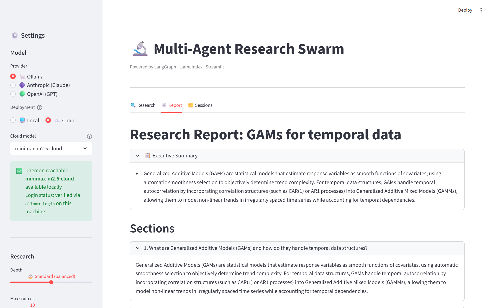

# 🔬 Multi-Agent Research Swarm

A LangGraph-based autonomous research system. Give it a topic; a swarm of specialised AI agents researches it, critiques the findings, fact-checks every claim, and writes a structured report - with optional human review before the final draft.

**Live demo:** [huggingface.co/spaces/maitreya18/research-swarm](https://huggingface.co/spaces/maitreya18/research-swarm)

Built with **LangGraph 1.2**, **LlamaIndex**, **ChromaDB**, and **Streamlit**.

---

## Architecture

```
START → supervisor (plan + complexity score)
          ↓
        document_pass_node ──► document_worker_node × N  (one-time, per ingested doc)
          ↓ (bounces straight through when nothing was uploaded)
        dispatch_node ──► worker_node × N  (parallel via Send, live web/arXiv/PubMed/Europe PMC)
          ↑                    ↓
          └── re-research  collect_node (stop-signal check + evidence persisted to RAG)
                                ↓
                          critic ──┐
                          ↑        ↓ (weak/refuted, under rework cap)
                          └── dispatch_node
                                ↓
                          fact_checker → writer (+ optional LLM judge) → END
```

**Phase 4 additions:** `dispatch_node` fans out to N parallel workers via LangGraph `Send`, one per sub-question. Each worker carries a role (`academic / industry / skeptic / benchmark / general`) chosen by the supervisor. `collect_node` decides whether to stop (marginal-gain threshold or hard round cap) or dispatch another pass. All non-LLM routing is deterministic - the supervisor LLM is called only once for plan creation.

**Document pass:** user-uploaded PDFs/URLs no longer go through chunk+embed+retrieve. `document_pass_node` fans out one single-shot extraction worker per document (or per size-bounded slice of an oversized one, split at sentence boundaries) before round-0 dispatch, producing ordinary `Finding`s the same way live research does. `_research_targets`'s round-0 check skips any sub-question a document already answered, so web workers don't duplicate that work. `retrieve_from_rag` still exists, but now only surfaces evidence discovered by *earlier rounds of the same session* (persisted by `collect_node` after every round) — not uploaded documents.

**Rework loop:** `critic` can route weak/refuted findings back to `dispatch_node` for targeted re-research, capped by `max_rework_attempts` independently of the overall round cap, so one chronically-bad finding can't hog rounds that would otherwise go to others.

**Budget:** LLM calls are split into two independent pools (`runtime/budget.py`) — a **research** pool covering the document pass and the dispatch/worker loop (the part that can genuinely run away across rounds and tool turns), and a smaller **review** pool covering critic/fact-checker/writer/judge (a few batched calls each). A research-loop overrun degrades gracefully instead of starving the review stage — the writer always runs on whatever findings exist, rather than the whole session producing an empty report.

**State** (`AgentState`) threads through every node as a single `TypedDict`. Custom reducers: `findings` merges by id (fact-checker overwrites in-place); `critiques` appends; `next_agent` tolerates concurrent same-value writes from parallel Send-fanned branches (e.g. several workers hitting an exhausted budget in the same step) instead of crashing.

---

## Quick Start

**Requirements:** Python 3.11–3.14, [Poetry](https://python-poetry.org/docs/#installation), at least one LLM API key. Tavily is optional (enables general web search; arXiv/PubMed/Europe PMC work without it).

```bash
git clone <repo-url> && cd swarm_agent_project
cp .env.example .env          # fill in API keys
poetry install
poetry run streamlit run app.py
# → http://localhost:8501
```

Windows: double-click `start.bat` - checks deps, optionally starts Ollama, opens the browser.

---

## Deploy to Hugging Face Spaces

This repo's README carries the frontmatter block (`sdk: streamlit`, `app_file: app.py`) a Spaces build reads directly — pushing this repo to a new Space is enough to build it, once the following are set:

**Space secrets** (Settings → Repository secrets) — the process defaults below assume a local Ollama daemon, which does not exist inside a Space container, so every provider field needs an explicit override:

```ini
ANTHROPIC_API_KEY=...             # or OPENAI_API_KEY
TAVILY_API_KEY=...                # optional — enables general web search
DEFAULT_MODEL_PROVIDER=anthropic  # or openai — never ollama on a Space
TIER_FAST_PROVIDER=anthropic
TIER_STANDARD_PROVIDER=anthropic
TIER_THOROUGH_PROVIDER=anthropic
```

`TIER_STANDARD_PROVIDER` also gets overridden per-session by whatever provider is selected in the sidebar (see `get_tiered_llm`'s worker-tier override) — but `TIER_FAST_PROVIDER`/`TIER_THOROUGH_PROVIDER` (critic/fact-checker and supervisor/writer) do **not** follow the UI selection, so they must be set explicitly or those nodes will still try to reach `localhost:11434` and fail on a Space.

**Space variables** (Settings → Variables, non-secret) — Spaces storage is ephemeral, so proactive cleanup replaces the "click delete" a hosted single-user server doesn't get:

```ini
DATA_DIR=/tmp/research_swarm_space
SPACE_MODE=true
SPACE_RETENTION_SECONDS=21600      # 6h — sessions older than this are pruned at startup
SPACE_MAX_SESSIONS=40              # oldest-first cap beyond retention
SPACE_MAX_CONCURRENT_RUNS=4        # in-process cap on simultaneous graph runs
```

`SPACE_MODE=true` is what turns on both the startup session-pruning pass (`app.py::_prune_sessions_once`) and the concurrency cap (`app.py::_RUN_SEMAPHORE`) — both are no-ops otherwise, so a local `poetry run streamlit run app.py` is unaffected by any of this.

If the Space's build doesn't use Poetry, `requirements.txt` at the repo root (hand-maintained in parallel with `pyproject.toml`'s dependency list) covers a plain `pip install -r requirements.txt`.

---

## Configuration

```ini
# .env - key settings (see .env.example for full list)
ANTHROPIC_API_KEY=...          # or OPENAI_API_KEY / leave blank for Ollama
TAVILY_API_KEY=...             # optional — enables general web search
DEFAULT_MODEL_PROVIDER=anthropic  # anthropic | openai | ollama
DEFAULT_MODEL_NAME=claude-sonnet-4-6
DEFAULT_DEPTH=standard          # shallow | standard | deep
MAX_ITERATIONS=10
MAX_SOURCES=15
MAX_LLM_CALLS=25               # hard budget per session
OLLAMA_BASE_URL=http://localhost:11434
```

All settings are overridable from the sidebar at runtime.

---

## UI





1. Enter a topic, select audience + depth, optionally upload PDFs/URLs (extracted directly into findings, no separate vector search step).
2. Click **Start Research** - live agent trace streams as the swarm works.
3. If HITL is on, approve findings before the Writer runs.
4. Switch to **Report** to read, copy, or download. Past sessions live in **Sessions**.

---

## Agents

| Agent | Role |
|---|---|
| **Supervisor** | Creates the research plan: an *exact* sub-question count per depth (not a ceiling — an unenforced "at most N" let the model under-decompose comparison topics), worker-role assignments, and a complexity score. Explicitly required to cover every side of a "X vs Y"-style topic, not just one. Only LLM-invoked once per session. |
| **Document workers** (×N) | One single-shot extraction pass per ingested document (or per size-bounded slice of an oversized one) before live research starts — no chunking, no retrieval, the model sees the full text. |
| **Workers** (×N) | Parallel ReAct tool loops over web/arXiv/PubMed/Europe PMC search - each researches one sub-question with a role-specific strategy (academic, industry, skeptic, benchmark, or general), routing to the tool that actually covers the sub-question's domain. Europe PMC also serves full-text XML for open-access biomedical papers, not just abstracts. |
| **Critic** | Reviews findings in batches (one LLM call per `judge_batch_size` findings, run concurrently): `supported / weak / refuted`. Weak/refuted findings trigger another dispatch round, capped both by the overall round limit and a per-finding `max_rework_attempts`. |
| **Fact-Checker** | Cross-checks claims against source snippets; adjusts confidence scores. Evidence-backed findings are floored at 0.15 so a mis-calibrated model can't zero out a claim that has real sources. |
| **Writer** | Synthesises validated findings into a structured report, citing each source precisely rather than attaching a finding's whole source list to every sentence derived from it. Runs a per-section faithfulness check and rewrites only the sections that fall below threshold. |
| **LLM Judge** *(optional)* | An independent LLM review pass over the finished report — catches what embedding similarity can't (wrong topic, an unaddressed sub-question, a citation to a reference that doesn't exist). |

---

## Quality & Safety

| Feature | Detail |
|---|---|
| **Dual budget pools** | LLM calls split into a **research** pool (document/web workers — the part that can genuinely run away across rounds) and a smaller **review** pool (critic/fact-checker/writer/judge). A research-loop overrun degrades gracefully instead of starving the review stage of the budget it needs to produce a real report. |
| **JSON-repair recovery** | Structured-output failures caused by unescaped backslashes (e.g. raw LaTeX in a claim breaking `json.loads`) are repaired and reparsed instead of discarding a real, already-generated answer. |
| **Cross-encoder reranker** | `bge-reranker-base` (CPU, 280 MB) reranks RAG chunks by relevance before returning to the researcher. |
| **Faithfulness check** | BGE embeddings score each report section against its cited snippets; sections scoring below threshold get a targeted rewrite, retried up to 3 times (re-scoring and re-targeting only sections still weak each pass) before the writer moves on. |
| **SSRF protection** | URL fetcher validates every hop against a private-IP blocklist; fetched content is sanitised for prompt-injection patterns. |
| **Schema migration** | `migrate_state()` upgrades v0/v1 checkpoints to the current schema on resume - no manual DB work needed. |

---

## Retrieval Quality (BEIR)

RAG retrieval evaluated on three [BEIR](https://github.com/beir-cellar/beir) datasets (seed 42, 100 queries each, last rerun 2026-08-23). Metric: **nDCG@10**.

| Dataset | BM25 ¹ | Contriever ¹ | BGE-Large ¹ | **Ours (BGE-small, dense)** | **Ours (+ reranker)** |
|---|---|---|---|---|---|
| SciFact | 0.678 | 0.677 | 0.752 | **0.749** | **0.755** |
| NFCorpus | 0.321 | 0.328 | 0.381 | **0.341** | **0.350** |
| ArguAna | 0.397 | 0.446 | 0.416 | 0.391 | 0.391 |

¹ Published baselines from the [BEIR paper](https://arxiv.org/abs/2104.08663) and [Resources for Brewing BEIR](https://arxiv.org/abs/2306.07471). BGE-Large is `bge-large-en-v1.5`; our embedder is the much smaller `bge-small-en-v1.5` (~130 MB vs ~1.3 GB).

The cross-encoder reranker (`bge-reranker-base`, swapped in from `ms-marco-MiniLM-L-6-v2`) is guarded: skipped for queries longer than 8 words (most scientific queries) to avoid out-of-distribution degradation. It never regresses nDCG@10 versus dense retrieval alone across the three BEIR sets, but is markedly slower on CPU than the smaller ms-marco model it replaced and loses to it on NFCorpus's short keyword queries. See [`benchmarks/README.md`](benchmarks/README.md) for the full per-dataset breakdown, reranker latency comparison, and the reasoning behind the model choice.

---

## Development

```bash
# Run all 349 tests (fully offline - all LLMs mocked)
poetry run pytest

# Specific test file
poetry run pytest tests/unit/test_graph.py -v

# Golden regression set (3 topics, full pipeline)
poetry run pytest tests/golden/ -v

# Lint / type-check
poetry run ruff check .
poetry run mypy research_swarm/

# Run a live research job without Streamlit
poetry run python run_research.py "your topic here"
```

---

## LLM Providers

| Provider | Requires | Notes |
|---|---|---|
| `anthropic` | `ANTHROPIC_API_KEY` | Claude Haiku (fast tier) / Sonnet (standard) / Opus (thorough). |
| `openai` | `OPENAI_API_KEY` | GPT-4o-mini / GPT-4o. |
| `ollama` | Ollama running locally | No API key. `start.bat` auto-starts `ollama serve`. Default: `gemma4:31b-cloud` (best grounding + faithfulness). |

**Note:** general web search (Tavily) is optional, not required to run this project. Workers and the
fetch pass fall back to arXiv, PubMed, and Europe PMC — all keyless — when `TAVILY_API_KEY` isn't
set. Set it as an environment variable (`.env` locally, or a Space secret when deployed) only if you
want general web-page results in addition to those three sources.
