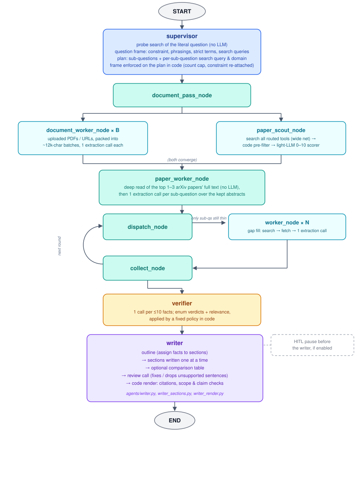
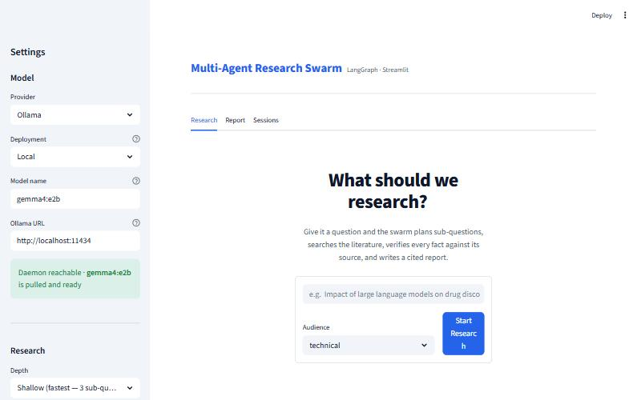
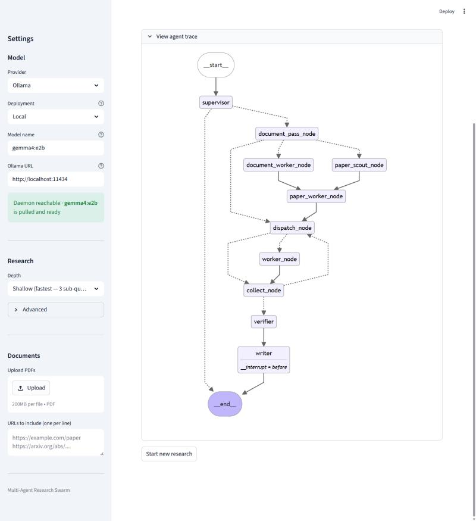
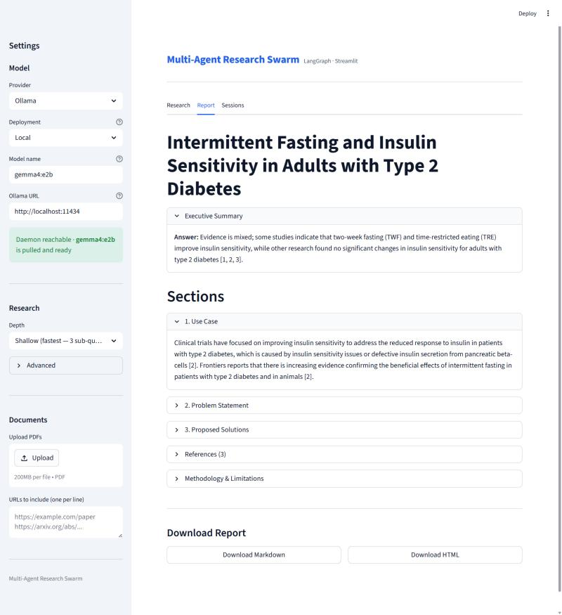

# Multi-Agent Research Swarm

A LangGraph research pipeline. Give it a question and it:
- works out what the question is really asking;
- plans sub-questions;
- searches PubMed, Europe PMC, arXiv and the web;
- extracts facts with verbatim quotes and locates each quote in its source;
- verifies every fact against that evidence;
- writes a report whose every sentence is tied to the facts it rests on.

A human can review the findings before the report is written.

**Live demo:** [huggingface.co/spaces/maitreya18/research-swarm](https://huggingface.co/spaces/maitreya18/research-swarm)

Built with **LangGraph 1.2** and **Streamlit**. A FastAPI backend, a Next.js UI and a Gradio Space app are also included.

**Design stance:**
- **Evidence first.** An LLM call is spent only on judgments that need language understanding. Everything that can be checked in code is checked in code: quote location, citation numbering, scope, strict-claim wording and duplicates.
- **Local first.** Research runs on a small local model (`gemma4:e2b` via Ollama). A larger model (`gemma4:31b-cloud` on Ollama Cloud by default) guards only the planner and the writer. It can be removed with one setting on a bigger GPU.

---

## Architecture



**Stages**

| Stage | What it does |
|---|---|
| **Question frame** (`agents/expansion.py`) | Extracts, once, what separates the question from its general subject: for example "*across different LLMs*" in a question about KV-cache transfer. Every later stage enforces that constraint in code, so a small planner that drops it can no longer derail the run into an adjacent topic. |
| **Supervisor** (`agents/supervisor.py`) | Writes the plan: a fixed number of sub-questions per depth (3 / 5 / 7), each with a keyword search query and a domain. Code caps the count and re-attaches the constraint to any sub-question or query that lost it. |
| **Paper scout** (`agents/papers.py`) | Searches every sub-question concurrently, pooling up to 48 candidates per sub-question. The frame's queries and probe hits are added to every pool. A code pre-filter (word overlap, scope match, primary sources over secondary) narrows the pool to 24. A light LLM then scores each against its sub-question; a paper that misses the scope scores at most 4. No embeddings, no vector store. |
| **Deep read** (`agents/deep_read.py`) | Fetches the full text of the top primary arXiv papers (1 / 2 / 3 by depth), keeps the ~6,000 characters that best match the question, and appends them to the abstract, so a paper's specifics come from the paper and not from blogs summarising it. |
| **Extractor** (`agents/extractor.py`) + **grounding** (`agents/grounding.py`) | One call turns a batch of sources into facts, each with a verbatim quote and a relevance label (`direct` / `background`). The quote is located in its source (exact, then fuzzy), and the surrounding sentences become the fact's evidence. A fact whose quote cannot be found is refuted without an LLM call. |
| **Gap fill** (`agents/gap_fill.py`) | Runs only for sub-questions still lacking a grounded, on-scope, non-background fact: search → fetch the top pages → one extraction call. |
| **Verifier** (`agents/verifier.py`) | Gives each fact a `supported` / `partial` / `unsupported` verdict and a relevance label (`direct` / `background` / `off_topic`) against its evidence. A fixed policy table in code turns the verdicts into critiques. |
| **Writer** (`agents/writer.py`, `writer_sections.py`, `writer_render.py`) | Runs in these steps: 1. an outline call assigns each fact to one section; 2. evidence sections, then synthesis, then the overview are written one at a time, each seeing the sections before it; 3. an optional comparison-table call; 4. a review call rules on every sentence with strong wording and fixes or deletes unsupported sentences; 5. code renders the report: numbers citations, drops sentences whose citations don't back them, and removes duplicates, markup and invented attributions. |

**Report shapes by audience:**
- **Academic:** Abstract / Previous Work / Experiments / Discussion.
- **Technical:** Use Case / Problem Statement / Proposed Solutions / Conclusion.
- **General:** article-style headings.
- **Executive:** a single paragraph.

Every report ends with a reference list generated in code, plus methodology and limitations. Sub-questions the evidence did not answer are listed as gaps rather than filled with nearby material.

**Strict claims:** questions such as "is it *lossless*?" or "is it *exactly* equivalent?" carry a proof criterion. An answer that asserts the strict term is removed unless a cited fact states it. Accuracy numbers, "negligible loss" and variance explained do not count as proof.

**State:** `AgentState` (`schemas/state.py`) is a single `TypedDict`:
- `findings` merges by id;
- `critiques` is append-only;
- `next_agent` tolerates concurrent identical writes from Send-fanned branches.

The SQLite checkpoints are migrated forward on load (`runtime/migrations.py`).

[TECHNICAL_HANDOFF.md](TECHNICAL_HANDOFF.md) is the engineer's reference: stages, state, configuration and known limitations.

---

## Quick Start

**Requirements:**
- Python 3.11–3.14 and [Poetry](https://python-poetry.org/docs/#installation).
- [Ollama](https://ollama.com) running locally with `gemma4:e2b` pulled.
- An Ollama Cloud API key (`OLLAMA_API_KEY`) for the default large model. This is optional: set `LARGE_MODEL=` to run everything locally.

Tavily is also optional; arXiv, PubMed and Europe PMC need no key.

```bash
git clone <repo-url> && cd swarm_agent_project
cp .env.example .env          # set OLLAMA_API_KEY (and optionally TAVILY / Anthropic / OpenAI keys)
ollama pull gemma4:e2b
poetry install
poetry run streamlit run app.py
# → http://localhost:8501
```

On Windows, double-click `start.bat`. It checks the dependencies, optionally starts Ollama and opens the browser.

**Headless run:**

```bash
poetry run python run_research.py "your question here"
```

**REST API:**

```bash
poetry run uvicorn api.main:app
```

The endpoints are:
- `/api/research`: start a run, stream it over SSE, check its status, resume it with approve / edit / discard;
- `/api/sessions`;
- `/api/config`.

---

## Timing and cost

Research runs locally. Measured on one consumer GPU, gemma4:e2b takes about 24 s per scoring call and about 33 s per extraction call, or about 55 s of model time per sub-question. Two requests share the GPU.

Everything that scales with the chosen depth lives in one setting, `depth_profiles`, and is not exposed in the UI:

| Per depth | shallow | standard | deep |
|---|---|---|---|
| Sub-questions | 3 | 5 | 7 |
| Gap-fill workers per round (least-covered first) | 2 | 3 | 5 |
| Gap-fill rounds (max) | 1 | 2 | 3 |
| Candidates gathered per sub-question (search, no LLM) | 32 | 48 | 64 |
| Candidates the scorer reads per sub-question | 16 | 24 | 32 |
| Papers kept per sub-question | 4 | 6 | 8 |
| Papers read in full text | 1 | 2 | 3 |
| Facts sent to the writer (sub-questions x 6) | 18 | 30 | 42 |

Sub-questions are the main cost. A shallow run of 6 sub-questions measured 4–8 minutes end to end; with 3, shallow should take roughly 2.5–4 minutes, standard 4–6 and deep 6–9 (estimates, not yet measured). The large model is used for query expansion, planning and the writer's calls: about 10 cloud calls of 2–4 s each. Search is cheap, so it casts a wide net and narrows it in code before any LLM reads a candidate.

---

## Configuration

Key settings are shown below; `.env.example` and `research_swarm/config.py` have the full list.

```ini
DEFAULT_MODEL_PROVIDER=ollama          # anthropic | openai | ollama
DEFAULT_MODEL_NAME=gemma4:e2b
OLLAMA_BASE_URL=http://localhost:11434
OLLAMA_API_KEY=...                     # for the large model on Ollama Cloud

LARGE_MODEL=gemma4:31b-cloud           # "" = every stage uses the local tiers
LARGE_MODEL_OLLAMA_BASE_URL=https://ollama.com
LARGE_MODEL_STAGES=["supervisor","writer"]
WRITER_MODE=sectioned                  # sectioned | single

DEPTH_PROFILES={"shallow":{"sub_questions":3,...},...}   # per-depth scale (see above)
QUERY_EXPANSION_ENABLED=true           # false = no question frame (plan exactly as asked)
DEEP_READ_PAPERS=2                     # 0 = abstracts only
TAVILY_API_KEY=...                     # optional general web search
LANGSMITH_API_KEY=...                  # optional LangSmith tracing
```

The sidebar sets these per run:
- provider and model;
- depth;
- the HITL toggle;
- the LLM-judge toggle;
- document upload.

The Audience dropdown sits next to the question box.

**Running without the cloud:** on a GPU that serves a bigger local model, set `LARGE_MODEL=` and point the `TIER_*_MODEL` settings at the bigger model. Alternatively, set `LARGE_MODEL` to a local tag with `LARGE_MODEL_OLLAMA_BASE_URL=`.

---

## UI







1. Enter a question, pick the audience and depth, and optionally upload PDFs or URLs. Uploads go straight to extraction and skip search.
2. Click **Start Research**. A live trace and topology diagram show each stage as it runs: the current node is amber and visited nodes are green. The supervisor card shows the question frame the run is working from.
3. The run is a background job, so changing sidebar settings mid-run doesn't interrupt it; the changes apply to the next run. **Cancel run** stops it.
4. If HITL is on, review the findings:
   - **Approve & Write** runs the writer, with optional instructions.
   - **Edit & Re-research** sends the weakly answered sub-questions back through gap fill with your keywords, then pauses again before the writer.
5. Read, copy or download the report (Markdown or HTML) in **Report**. Past sessions are listed in **Sessions**.

When LangSmith is configured, each run links to its LangSmith trace. Every stage, LLM call and tool call is also traced locally to `data/traces/<session>.jsonl`.

---

## Quality & Safety

| Feature | Detail |
|---|---|
| **Scope enforcement** | The question frame's constraint is enforced in code at planning, scoring, coverage, verification and writing. A report says "No retrieved source directly addresses …" instead of answering an adjacent question. |
| **Claim-level attribution** | The model tags each sentence with the fact numbers it rests on, and code attaches the citations. A sentence is dropped if it cites facts that don't back it, contains numbers absent from its evidence, or names the scope or a strict term its facts don't mention. |
| **Primary sources first** | arXiv mirrors are merged into one reference. Secondary sources (blogs, Medium, LinkedIn, and so on) are ranked below papers and trimmed from citations when a primary source covers the claim. |
| **LLM concurrency and retry** | Each provider has a process-wide cap on in-flight requests (the local daemon and Ollama Cloud have separate pools). Calls retry transient errors (429, 5xx, timeouts) with jittered backoff. Thinking is turned off for structured-JSON stages. |
| **Budget pools** | LLM calls are split into a research pool and a review pool, with a session-wide token cap, so a research overrun can't leave the writer with nothing. |
| **Structured-output recovery** | JSON is repaired for unescaped LaTeX backslashes and for schema-echo replies. A stage falls back when it fails; each fallback is logged at ERROR and traced as `<stage>.fallback`. |
| **SSRF / injection** | The URL fetcher validates every redirect hop against private IP ranges. Fetched text is scanned for prompt-injection patterns. |
| **Schema migration** | Old checkpoints are upgraded on resume. |

---

## Development

```bash
poetry run pytest                  # 254 tests, fully offline (all LLMs mocked)
poetry run pytest tests/unit/test_writer_render.py -x -q
poetry run ruff check .
poetry run mypy research_swarm/
```

The tests run with query expansion off, the single-call writer, no large model and no deep read (`tests/conftest.py`), because those paths make live searches. The sectioned writer, expansion and deep read are covered by their own mocked tests.

Benchmarks and ablations live in `benchmarks/` (see [benchmarks/README.md](benchmarks/README.md)): a closed-corpus answer-quality benchmark (ALCE / HotpotQA / SciFact), a relevance-scorer benchmark and a live-question review harness (`benchmarks/quality_review/`).

---

## Deployment

- **Docker** (`Dockerfile`): Streamlit on port 8501, with `SPACE_MODE=true` and `DATA_DIR=/tmp/research_swarm_space`.
- **Hugging Face Space** (`hf_space/`): a Gradio app on ZeroGPU. The research stages run Gemma 4 E2B in-process with `transformers`; the planner and writer run on Ollama Cloud. See [hf_space/README.md](hf_space/README.md).
- `SPACE_MODE=true` turns on startup session pruning (`SPACE_RETENTION_SECONDS`, `SPACE_MAX_SESSIONS`) and a cap on concurrent runs (`SPACE_MAX_CONCURRENT_RUNS`). Without it these are no-ops.
- A container has no local Ollama daemon, so set every `TIER_*_PROVIDER` explicitly (anthropic / openai), or point `OLLAMA_BASE_URL` at `https://ollama.com` with `OLLAMA_API_KEY`.

---

## LLM Providers

| Provider | Requires | Notes |
|---|---|---|
| `ollama` | Ollama running locally | Default. Research stages run on `gemma4:e2b`. Cloud models go through `ollama login` on the daemon, or directly to `https://ollama.com` with `OLLAMA_API_KEY` (the large-model path). |
| `anthropic` | `ANTHROPIC_API_KEY` | Claude models on every tier. |
| `openai` | `OPENAI_API_KEY` | GPT models on every tier. |
| `huggingface` | a GPU, plus `torch`, `transformers>=5.5` and `lm-format-enforcer` | Runs `HF_MODEL_ID` (default `google/gemma-4-E2B-it`) inside the app process (`agents/hf_local.py`). Used on the ZeroGPU Space. Concurrent calls are micro-batched and each reply is constrained to its JSON schema. |

General web search (Tavily) is optional. Without `TAVILY_API_KEY`, search uses arXiv, PubMed and Europe PMC, which need no key.
